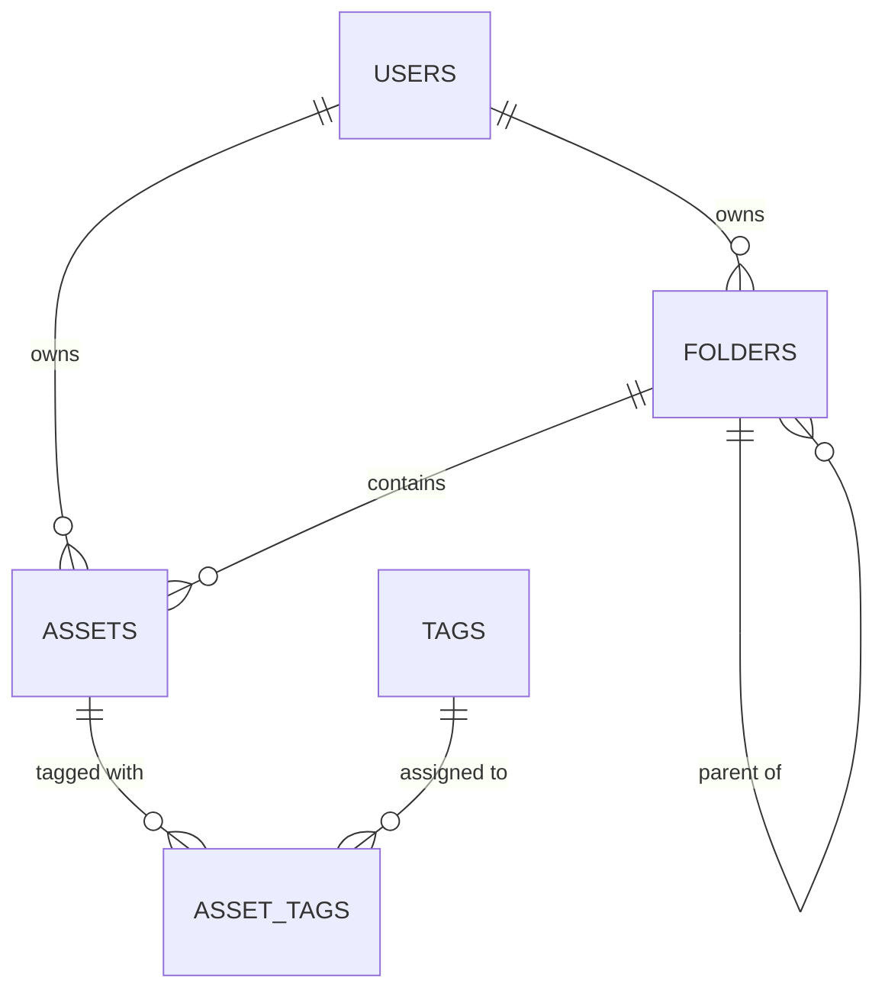

# Database Schema Design: NOVA

Sprint 1의 모바일 수집가와 Sprint 2의 데스크탑 매니저가 공유하는 통합 데이터베이스 스키마 설계도입니다. AI 태깅, 계층형 폴더, 스마트 폴더를 지원하기 위한 테이블 구조를 정의합니다.

Designing a schema to ensure that metadata collected by the **Sprint 1 (Mobile Collector)** is fully usable by **Sprint 2 (Desktop Manager)** folders and dynamic "Smart Folders".

## 1. Core Principles

1. **Source Agility**: Whether captured via camera, drag-and-drop, or browser extension, all entries create a unified `Asset` record.
2. **AI First**: Fields like `palette`, `auto_tags`, and `dominant_color` are treated as first-class citizens for immediate Sprint 1 categorization.
3. **Flexible Hierarchy**: Sprint 2 folders are optional; assets can exist without a folder (uncategorized) but still appear in "Smart Folders" based on metadata.

---

## 2. Table Definitions

### 2.1 `assets`
The central store for all design assets (images, captures, etc.).

| Column | Type | Description |
| :--- | :--- | :--- |
| `id` | `UUID` (PK) | Unique identifier. |
| `user_id` | `UUID` (FK) | Reference to `auth.users`. |
| `storage_path` | `TEXT` | Path to the file in Supabase Storage. |
| `thumbnail_url` | `TEXT` | Generated thumbnail for grid view optimization. |
| `file_name` | `TEXT` | Original filename or auto-generated label. |
| `file_size` | `BIGINT` | Size in bytes. |
| `mime_type` | `TEXT` | e.g., `image/png`, `image/webp`. |
| `source_url` | `TEXT` | Original URL if captured from the web (Sprint 2). |
| `phash` | `TEXT` | Perceptual Hash for similarity-based search and deduplication. |
| `palette` | `JSONB` | Array of 5 hex codes extracted by AI (Sprint 1). |
| `folder_id` | `UUID` (FK, NULL) | Reference to `folders`. (Sprint 2). |
| `metadata` | `JSONB` | AI-extracted classification (e.g., `{ "comp": "button", "obj": "phone" }`). |
| `sha256` | `TEXT` | File hash for integrity and deduplication. |
| `created_at` | `TIMESTAMPTZ` | Default: `now()`. |
| `updated_at` | `TIMESTAMPTZ` | Updated on manual edits. |

### 2.2 `folders` (Sprint 2)
Manual hierarchical organization.

| Column | Type | Description |
| :--- | :--- | :--- |
| `id` | `UUID` (PK) | Unique identifier. |
| `user_id` | `UUID` (FK) | Reference to `auth.users`. |
| `parent_id` | `UUID` (FK, NULL) | Recursive reference for nested subfolders (Unlimited tree). |
| `name` | `TEXT` | Display name. |
| `is_smart_folder` | `BOOLEAN` | If true, this folder uses virtual query conditions. |
| `conditions` | `JSONB` (NULL) | Query parameters (only if `is_smart_folder` is true). |
| `auto_tags` | `JSONB` | Tags to automatically apply to assets dropped into this folder. |
| `created_at` | `TIMESTAMPTZ` | Default: `now()`. |

## 3. Relationship Diagram

### Key Indices:
- `idx_assets_user_id`: For fast retrieval of user data.
- `idx_assets_folder_id`: For folder navigation.
- `idx_folders_parent_id`: For recursive tree building.
- `idx_assets_palette`: GIN index for color-based searching.
- `idx_assets_metadata`: GIN index for AI classification filtering.

## 4. Migration Strategy (Sprint 1 to 2)

### Sprint 1

- We begin with just `assets`, `tags`, and `asset_tags`.
- Every upload triggers an edge function to populate `palette` and `metadata`.
- Assets default to `folder_id = NULL` (Uncategorized).

### Sprint 2

- Introduce `folders` (including smart folder flag).
- Update UI to allow batch moving assets into folders (sets `folder_id`).
- Implement query logic for folders with `is_smart_folder = true`.
